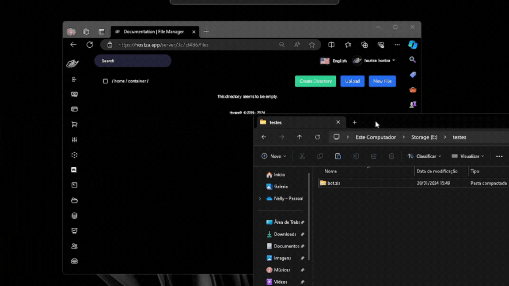

# Python

## Introduction

This tutorial will have you deploying a Python app to Square Cloud in minutes.

The tutorial assumes that you have a [Hostza account](https://hostza.app/auth/login), and that you have [Python](https://www.python.org/downloads/) installed locally.

## Required Files 

* main.py (Example of main file).
* requirements.txt (dependency file).

## Preparing Files for Upload

Before hosting your project on Hostza, you must first have the files of your project properly configured, so that you can host it later.

It is recommended to **delete** the `__pycache__` & **ffmpeg** folder, if it exists in your project.

After the files of your project are ready _(and the unnecessary files deleted)_, just zip them in **.zip** format before uploading to Hostza.

## Uploading Files to Hostza

After preparing your project files, you can now upload them to Hostza and host your project. Access the [Hostza Dashboard](https://hostza.app/auth/login) and upload your project files.

<figure><figcaption></figcaption></figure>

